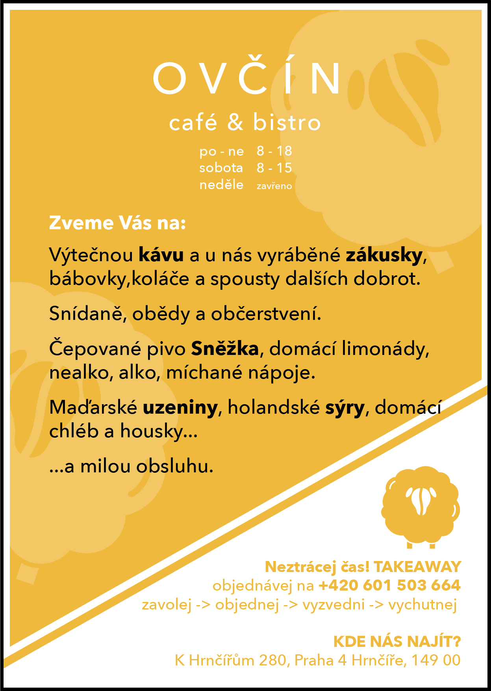

# Case study- Visual identity for the cafe.

This project was for me the first bigger project outside of school. My work was to make a visual identity for the cafe. The only thing that was clear was the name of the cafe (Ovčín = Sheepfold). Name was chosen by the customer I worked for. The first thing I had to do was logo. The customer wanted something friendly, original and easy to remember. This was my first problem. The original logo in the world of cafes. We have a cafe everywhere in Prague. So the first thing I had to do was research other cafes visual identities to make a different one. I wanted to connect this cafe with the place where it is located. So I combined a sheep (animal) with a coffee bean. I made a coffee bean in the shape of a sheep's head. At the same time, I wanted the pictogram work without the name of the cafe below. I am quite happy with the final logo, which we choose.
 
 

`Logo- Shape of sheep and inside is coffee bean in the shape of a sheep's head.`
 
 

`Paper coffee pack with logo.`
 
 
Other publications I made were billboards throughout the village. We wanted something distinctive, but still color-coordinated with the interior of the cafe. The interior of the cafe is mostly wooden. The only distinctive element in the cafe are the colorful armchairs. So we decided together that we would tune the ads for the cafe to mustard yellow. The first thing I started working on was business cards. These are important for customers because you can order meals to take with you. I still wanted to make it simple, but at the same time recognizeable that the customers would notice this business card in their wallet among others.
 
 

 
`The interior of the cafe, where we can see yellow seats.`
 
 

`Yellow busssines card.`
 
 
We also made a lot of posters around the village. For example: arrows on bike paths, posters on many places and, last but not least, leaflets in mailboxes. The village is small and there is no other cafe nearby, so we wanted to let the people know that something like this is newly opened.
 
 

`Yellow leaflet in mailboxes.`
 
 
On the marketing side, I helped her do an instagram. On the instagram, customers can see everyday what is cooked that day and what desserts they can look forward to. We've also come up with a hashtag that customers can add to their photos. And it works. Customers tag us in the photos and this makes this cafe known to other people.Another marketing move we are going to do next summer is that there will be a live sheep at the cafe's garden. Lots of people go to instafriendly cafes. Where is the pleasant environment and where they can take a nice photo of them or around. I think a live sheep could attract children as well.
In the future, I’m going to make a page for the café in a local magazine and also make a menu. I want to do everything in the same modern and simple spirit.
 
 

`Ovčín from the outside.`
 
 
Follow us on instagram: @ovcin_cafebistro
The website will be out soon.
