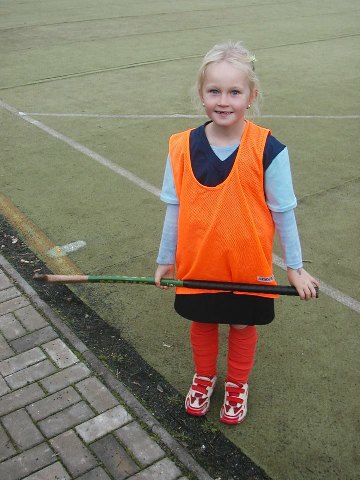

# My field hockey way

My name is Adéla and I will talk about field hockey. 
Why?
Field hockey is a big part of my life and I think my way 
from a girl who was „smaller“ than a hockey stick 
to national team player can be interesting.

`2004.`

### What if field hockey?
OLYMPIC SPORT
### What do you need?
Stick - A field hockey stick has two sides. One is round and one is flat. We can only play flat. This makes our sport more technically demanding, so please do not confuse it with floorball or hockey. We hate that.
Ball -  Again. It's not a floorball balloon. This one is as heavy and hard as a hockey puck.
Place - Then you need a field that is only 10 meters shorter than the football field.
The last thing you need is your friends. Your team you spend a lot of time with.

### How it went - beginings 2004
When I was little, I excelled a lot on the ground, because I was talented and that's why I was on the team with girls who were 3 or 4 years older, for example. I started playing field hockey because my mom had a girlfriend and her twin daughters played it, so I had to too.
The first season I played, we were the champion of the Czech Republic. So my first medal was gold.
Time was running out and I grew up and played for 13 years in the Hc Hostivař team which is in Prague.
My first great success in 2016 when I won the best shooter of the year in juniors and at the same time we won gold medals. What preceded it? 2 years before, I was in the national team under 16 for the first time. We brought silver medals to the Czech Republic after the tournaments and everyone was very proud of us. In the final for gold, we lost to the Russians. Since the beginning of what I have been playing in the national team, I have the number 16 on my back, because it is my mother and dad's favorite number.
The next year I was at sea with the national team in Italy. And in 2016, I played my most interesting tournament in my career. It was in Glasgow, Scotland and we brought in bronze medals. In the match for 3rd place, we played with the home team Scotland. So there were 10,000 fans from Scotland in the stands and we had no one there. You say it's bullshit, but the fans help us a lot in the game. 1 minute until the end, the match was 1: 1, and we had a player on the penalty bench.
8 seconds until the end of the match, they hit me and had to take me off the field in arms.This match was broadcast live, so this wasn't nice to my mom when she didn't know what was wrong with me. In the end, we won the match for raids.
### Now
I have been playing for Pilsen for the last 3 seasons and I am more satisfied there than ever before.
Although we are a contactless sport, it sometimes hurts.But what is the worst thing for us field hockey players is the bad tan. haha

## What did hockey give me?
### Happiness  
The feeling when you win something is indescribably great and that's why I play it for so long because I want to win again and again.
### Learn to lose  
the sport is not just about winning. Not even life.
### My best friend  
We are rivals because we each play for a different team. But we met when we started playing together in the national team and we have been an inseparable couple ever since.
### Teamwork  
I think it's an important ability to work with people.
### Friends 
And the last of a lot of friendships and experiences that I would not exchange for anything in the world.

I guess I just want to say that I'm very happy with what I got thanks to field hockey and where I've been everywhere.
