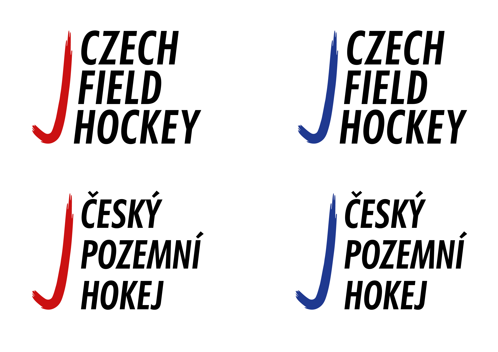

# Visual identity and marketing strategies for field hockey

### Draft

This bachelor thesis deals with the creation of a new visual style for the already functioning field hockey sport. At first, describes the visual and marketing state of the sport in the Czech Republic. Then compares the visual and promotional functioning of other countries of field hockey in the country and also analyses other sports in the Czech Republic. In practical terms, there's a presentation of my suggestions for a better running of the sport. The target is to make a new visual style and marketing strategies to better promote and attract sponsors and money. 

Key words: field hockey, sport, marketing strategy, visual style, identity, graphic design, media design
