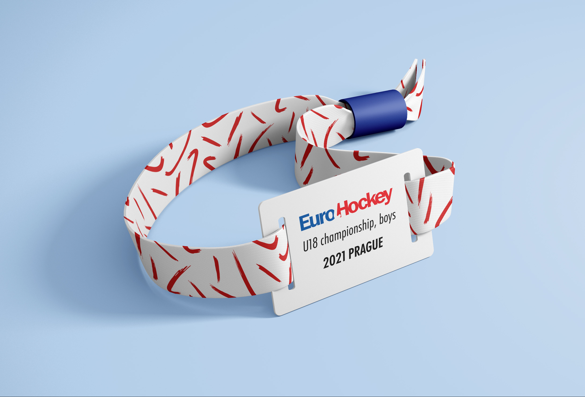

# Visual identity and marketing strategies for filed hockey

`New logo for field hockey.

## Abstract
This bachelor thesis explores a new visual style and marketing strategy to promote field hockey in the Czech Republic. Initial research examines the current state of the visual communication and marketing strategies of the sport. Then followed by a comparison of the visual and promotional campaigns of field hockey locally and in other countries, and an analysis of other sports in Czechia. The resulting work is a presentation that outlines and documents recommendations for organizing and operating a successful national field hockey campaign. The work aims to develop a new visual style and marketing strategy to better promote and attract paid sponsorship for field hockey as a national sport in the Czech Republic.

Keywords: field hockey, sport, visual style, identity, graphic design, marketing strategy

## Field hockey
Field hockey is an olympic sport for women and men. It is known around the world as hockey. In the Czech Republic, when somebody says hockey, everyone imagines ice hockey. I would like to help field hockey to become visible. Field hockey has an old logo that is not complex with the whole visual. That's why I decided to redo it.

## My bachelor thesis
My bachelor thesis will deal with a new visual style for field hockey.  I chose this topic because I am playing field hockey for 17 years and I would like to help popularize this sport.  The current state of field hockey in the Czech Republic is quite terrible.  I decided to redesign the logo in the first place.  I wanted a simple, modern, but memorable logo.  the hockey stick in the logo can be red or blue like the Czech tricolor.  but the whole visual style is not just about the logo.  My visual style is complex with all print materials and merchaindising.  Part of my bachelor thesis are also to come up with new marketing strategies.  Much of my marketing strategies take place on social networks.  Especially on the Instagram.

`Instagram feed.

`Instagram post.

Here you can see a post in which czechfieldhockey inform followers about weekend matches.
Some of the posts have a hockey stick frame from the logo.

`Billboard design.

I include billboards among the printed materials.  You can see that the Hockey stick next to the word yes is used as a pipe.  This is how a poster at a bus stop might look like. Other press material are diplomas.

`Design of diplomas for women and men.

`Design of poster on bus station.

`Design of diplomas for kids.

This is a diploma for children. On the diploma we can see for which category the diploma is obtained and for which team.  It's not on adult diplomas.

Other press materials are writing papers and envelopes. Nowadays, everything is electronic, so I prepared a signature for e-mail.  Definitely in a complex visual style, there must be business cards that represent this sport.

`E-mail signature.

`Design of bussines card.

As one of the ideas for making money, I came up with the idea that field hockey would have merchandise. merch also includes small gifts that children will win in tournaments.  Field hockey will have own clothes.  For example hoodie.  The colors of the sleeves would change according to gender for the national teams.  Women will have red sleeves and men blue.  a fan can buy this hoodie too and he can buy what color they wants.  Another distinction between a national player's hoodie and a fan is that the national player will have his number written on pocket.  Other clothes are a women's bra, socks and a training shirt.

`Hoodie design.

`Bra design.

`Socks design.

Last but not least, I prepared a visual of the new medals.  

`Medal design.

Once in a while, the European Championship is played in the Czech Republic.  This event is usually more daily, so I designed a visual of bracelets for more daily entry.

`Bracelets design.

## Field hockey
Field hockey is an olympic sport for women and men. It is known around the world as hockey. In the Czech Republic, when somebody says hockey, everyone imagines ice hockey. I would like to help field hockey to become visible. Field hockey has an old logo that is not complex with the whole visual. That's why I decided to redo it.
